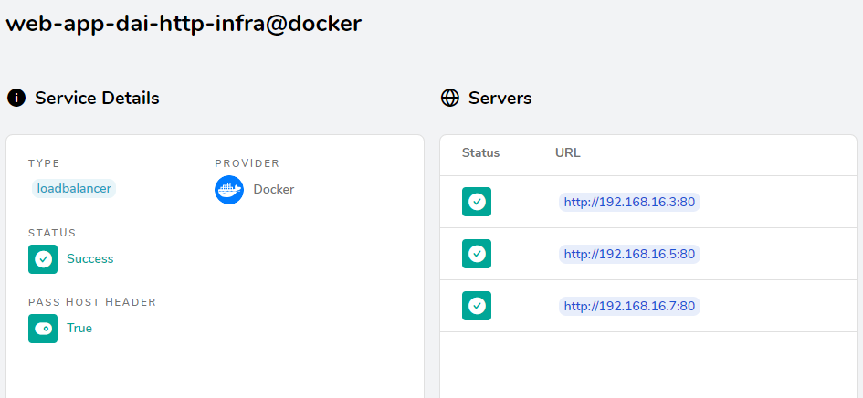

# HTTP infrastracture lab
## STEP 0: GitHub Repository
I created the new git repository inside the GitHub website added ReadME and .gitignore files.

## Step 1: Static Website
I downloaded a template (one page) from Start Bootstrap.
Then I pulled the official nginx:latest image, hosted on the Docker Hub and I run it in a container. 
To do this, I run the command: ```docker run -it --rm -d -p 8080:80 --name web nginx```.
After running the container as a daemon (-d) and published it on port 8080 on the host network, opening a browser and navigating to http://localhost:8080, I can see the NGINX welcome page.

To make a custom website, I added the files of the downloaded template in a directory named static-site-content/static-site-files.

To build a custom image, I created a Dockerfile inside the static_site_content directory.
My custom image is built on top of the nginx image (```FROM nginx:latest```). 
I added a line to copy my static files in the right place (the default directory to serve static files) on the nginx server:
```COPY ./static_site_files /usr/share/nginx/html```.

I didn't add any ```ENTRYPOINT``` neither ```CMD```, since they are provided by the base NGINX image.
I also added the line ```EXPOSE 8080``` to inform Docker that the container will listen on the port 8080 at runtime.
I built my custom image with the command: ```docker build -t webserver . ```
(the point is important to specify the directory!)

After running the newly created image in a container at port 8080, my static website is being served correctly.
Command: ```docker run -it --rm -d -p 8080:80 --name custom_nginx webserver```. Then go to localhost:8080

This works because nginx has a default configuration, that is already enough.
Since I want to have a custom configuration, I enter the bash of the nginx service running on Docker and look for the default configuration (that's already working) to copy it in my directory.
To enter the bash:
```docker exec -it <id-image-with-nginx> /bin/bash```.

Then the configuration that I need to copy can be found under /etc/nginx/conf.d/. Its name is default.conf.
This configuration is referenced by the main nginx.conf configuration file, under /etc/nginx/.

So I created a custom configuration file copying the content of the default.conf file, with a basic Nginx configuration.
In this file, that I simply named nginx.conf, I configure nginx to listen on port 80 and to serve the static files from the default /usr/share/nginx/html directory, where I copied the files thanks to my Dockerfile.

To copy my nginx configuration file in the default nginx configuration folder, I added to the Dockerfile the line:
```COPY ./nginx.conf /etc/nginx/conf.d/default.conf```

I deleted and built my custom image again with ```docker build -t webserver .```
And now again, my static website is being served correctly.

## Step 2: Docker compose
I added a docker-compose.yml file in the same directory of my Dockerfile (my project directory).
It contains a simple configuration for one single service, called web_app.

In this configuration, I specified the container name, the image name and the context where to find the Dockerfile to rebuild the image:
```
  web_app:
    container_name: custom_nginx
    image: webserver
    build:
      context: ./static_site_content/
    ports:
      - "8080:80"
```
Thanks to the build command, whenever we run ```docker-compose built```, the image of the server will be recreated based on the specified Dockerfile.

Now I can start and stop my simple infrastructure with a single static web server using docker compose, I can access the web server on my local machine on the port 8080 and rebuild the docker image with the docker compose build command.

## Step 3: HTTP API server
I decided to build an API to store pizzas with their ingredients. I store data directly in memory.

With this API, it's possible to:
- read all the pizzas that are saved in memory (```GET on /api/pizzas```)
- read one pizza given its id (```GET on /api/pizzas/{id}```}
- create a new one (```POST on /api/pizzas, with a JSON body for the pizza to create```) 
- update an existing one (```PUT on /api/pizzas/{id}, with a JSON body to replace the original pizza```)
- delete an existing one (```DELETE on /api/pizzas/{id}```)

To test my API I used Bruno.

I create the jar file with all dependencies of my application using maven (mvn clean and mvn package).

At this point, I create the Dockerfile for this API`service.
My Pizza API service will run on port 7000. 
I build the new image with the command: ```docker build -t pizza_api .```
I run a container based on the image to check that everything works fine: ```docker run -p 7000:7000 --name pizza_api_service pizza_api```
Since this works well, I add this service to my docker-compose file:
```
  pizza_api:
    container_name: pizza_api_service
    image: pizza_api
    build:
      context: ./api/
    ports:
      - "7000:7000"
```

## Step 4: Reverse proxy with Traefik
I added a new service called "reverse_proxy" to my docker compose file, using the Traefik official docker image.
After reading the documentation, I changed the docker-compose file to add the Traefik configuration.
The final docker-compose file has a reverse_proxy service with the following parameters:
```
  reverse_proxy:
    image: "traefik:v2.10" -> the official Traefik image
    build:
      context: ./traefik/
    command:
      - "--api.insecure=true" -> to be able to expose other ports rather than only port 80
      - "--providers.docker=true" -> to set docker as provider
    ports: -> to set the open ports
      - "80:80"
      - "8080:8080" -> this is the port we need to open to see the Traefik dashboard
    volumes:
      - "/var/run/docker.sock:/var/run/docker.sock:ro"
```

I also needed to add some extra-parameters to each of the other services:
- instead of "ports:..." now there is "expose:...", because the ports are already opened by the Traefik service.
- since in "expose" only the container port is needed (not the local one) there is "expose: 80" for the web app and "expose: 7000" for the api service.
- a new section "labels" is added with the following content:
````
  - "traefik.enable=true" -> to enable trafik for the service
  - "traefik.http.routers.<route_name>.rule=Host(`localhost`)" -> the domain the service responds to
````
 
Now, we can run docker compose up again to create the new infrastructure from scratch.

To access the static website, we can simply type "localhost", and to access the api service, "localhost/api".

To access the dashboard of Traefik, since we set ```--api.insecure=true``` in the docker compose file for its service, we can visit localhost:8080/dashboard/#/. 
There we can see much useful information:
- our defined entrypoints, with their respective ports
- the current active routes handled by Traefik for HTTP (the only one in our case), TCP, UDP
- which other features are set (like tracing or access logs)
- the providers we set

A reverse proxy is very useful, not only to improve performances (with load balancing, sending requests to different servers), but also to improve the security of the infrastructure.

Indeed, by intercepting requests, the reverse proxy protects the web server’s identity: a website or service never needs to reveal the IP address of their origin server(s).
In this way, the reverse proxy acts as an additional defense against security attacks: the attackers will only be able to target the reverse proxy, which will have tighter security and more resources to fend off a cyberattack.

Furthermore, a reverse proxy may provide other features like Web caching of static pages, sticky sessions and Virtual hosting.

## Step 5: Scalability and load balancing
To start several instances of a server inside the docker-compose file, it's very simple. We need to:
1) add deploy options with mode "replicated" and a fixed number of replicas
2) remove the container name for that server, so that docker can create multiple instances giving them different names

So, since we need to start several instances of our two servers, we repeat these steps twice.
For both the webserver and the pizza_api service I want to add 3 replicas, so I add:
```
deploy:
  mode: replicated
  replicas: 3
```

Then I remove the container-name I had specified (I commented the lines).
This is enough to start multiple instances when we run the command ```docker-compose up```.

We can check that there are 3 replicas running in the dashboard of Traefik, under HTTP Services.
Here we can verify that the number of servers running is 3 for both the static web app and the api.

Since I also want to be able to scale up and down (add/remove instances) my services, this is not enough.
Indeed, to achieve this goal, I need an orchestrator. A simple one, already linked with Docker, is Docker Swarm.
To deploy my services using Docker Swarm, I initialise docker swarm, running the command:

```docker swarm init```

After, I need to choose a name for my stack (I choose dai-lab-infra) and to run the following:

```docker stack deploy --compose-file docker-compose.yml dai-lab-infra```

This command will start, like before, the 3 replicas for each server that I demanded.
But now, if I want to change the number of replicas, I can just use the scale function (for one service or both of them).

To scale both the services: ```docker service scale dai-lab-infra_web_app=`2 dai-lab-infra_pizza_api=4```

Starting the services with docker swarm, we get two messages:
- build is an unsupported option
- exposing ports is unnecessary (services on the same network can access each other's containers on any port), so we could remove the "expose" option.

To stop and delete a container, we just need to specify the number of replicas equals to 0, or we can run:

```docker service rm <service_name>```

Note: to stop or delete the services through Docker Desktop will NOT work: once we exit one service, another one will be created and run to replace it.

## Step 6: Load balancing with round-robin and sticky sessions
Since so far we used round-robin to distribute the load among the available servers, every time we connect to a server, the information of the previous session is lost.
This is what we refer to as stateless.

For my API, I would like the information of a past session (like a pizza that I created) to be available when I reconnect.
This is possible if I also send the cookie previously sent to my client, to make the server recognize where the request comes from.
To do so, we can use sticky-sessions, which enable my API service to be stateful, so to "keep memory" of a previous state by asking the load balancer to direct my requests always to the same server.

To demonstrate this, I connect to my pizza_api using Bruno and I create a new pizza.
If then I try to get the newly created pizza, sometimes the server will return it, but most of the time it won't, since the new pizza is saved in the memory of a single server out of multiple ones.

Now I add the following lines to the Traefik section in my pizza_api service inside docker compose:
```
- "traefik.http.services.pizza_api.loadbalancer.sticky.cookie=true"
- "traefik.http.services.pizza_api.loadBalancer.sticky.cookie.name=sticky_pizza"
```

I stop and rerun my services (as explained in previous step).
I retry to create a new pizza with Bruno.
Now, every time I try to run a GET on the newly created pizza, the server returns it.

To check that my load balancer can distribute HTTP requests in a round-robin fashion to the static server nodes, I add access logging to Traefik by adding two lines to the "command" section:
```
- "--accesslog=true"
- "--accesslog.filePath=/logs/access.log"
```
Now that access log is enabled (that we can also check in the Traefik dashboard), we can access the Traefik container and read from the logs file, that is accessible at the specified path.
So when I access my static web page, I will find the information of which server is responding in the access log file.
After connecting to the static web page, this is what we can read in the access log file:

```
192.168.65.1 - - [12/Jan/2024:12:10:49 +0000] "GET / HTTP/1.1" 200 5868 "-" "-" 81 "web_app@docker" "http://192.168.16.5:80" 3ms
192.168.65.1 - - [12/Jan/2024:12:10:49 +0000] "GET /assets/img/02.jpg HTTP/1.1" 200 252376 "-" "-" 84 "web_app@docker" "http://192.168.16.5:80" 3ms
192.168.65.1 - - [12/Jan/2024:12:10:49 +0000] "GET /css/styles.css HTTP/1.1" 200 250247 "-" "-" 82 "web_app@docker" "http://192.168.16.3:80" 7ms
192.168.65.1 - - [12/Jan/2024:12:10:49 +0000] "GET /assets/img/01.jpg HTTP/1.1" 200 547797 "-" "-" 83 "web_app@docker" "http://192.168.16.7:80" 16ms
192.168.65.1 - - [12/Jan/2024:12:10:49 +0000] "GET /assets/img/03.jpg HTTP/1.1" 200 535000 "-" "-" 85 "web_app@docker" "http://192.168.16.3:80" 15ms
192.168.65.1 - - [12/Jan/2024:12:10:49 +0000] "GET /js/scripts.js HTTP/1.1" 200 339 "-" "-" 86 "web_app@docker" "http://192.168.16.7:80" 1ms
192.168.65.1 - - [12/Jan/2024:12:10:50 +0000] "GET /assets/favicon.ico HTTP/1.1" 200 23462 "-" "-" 87 "web_app@docker" "http://192.168.16.5:80" 0ms
```

As we can see, the server that responds is not always the same: for example, the first request is responded by the server with IP address 192.168.16.5, and after that we can see other responses from 192.168.16.3 and 192.168.16.7.
In my Traefik dashboard, under HTTP Services, I can click on web-app-dai-http-infra@docker to see the URLs of my servers, and they are exactly the ones I'm expecting to see.



So I proved that my load balancer is working properly and as expected, by transmitting the requests to different servers with a round-robin method.

## Step 7: Securing Traefik with HTTPS
I downloaded openssl and I created a new environment variable for using it in the command line simply typing "openssl".
Then I run the following command to create 2 files, the certificate and the key:

```openssl req -x509 -newkey rsa:4096 -keyout key.pem -out cert.pem -sha256 -days 366 -nodes -subj "/CN=localhost"```

They were successfully created in a folder that I added to the .gitignore file, to hide it from GitHub.

Then, to be able to specify a location to look for these files, I added a Traefik configuration file. 
It contains the following:
```
providers:
  docker: {}

entryPoints:
  web:
    address: ":80"

  websecure:
    address: ":443"

api:
  dashboard: true
  insecure: true

tls:
  certificates:
    - certFile: /etc/traefik/certificates/cert.pem
      keyFile: /etc/traefik/certificates/key.pem

accessLog:
  filePath: "/path/to/access.log"
```

After this, I removed the "command" options from the Traefik service configuration inside the docker compose file and I added the port 443.

Since Traefik was not able to open the trafik.yml file when I was simply adding it to the volumes to mount ("operation not permitted" error, probably a problem caused by the mapping of a Windows file to a Linux file, that was breaking file permissions), I created a Dockerfile with the image for my Traefik service, always based on the original Traefik image.
In this Dockerfile, I added two commands to copy the needed files:
```
COPY ./traefik.yml /etc/traefik/traefik.yml -> for the Traefik configuration
COPY ./certificates /etc/traefik/certificates -> for the https certificate and key
```

To activate the HTTPS entrypoint for the servers, I added two lines to the labels of web_app and pizza_api:
```
- "traefik.http.routers.<service_name>.entrypoints=web,websecure" -> to be able to access the services with the entrypoint websecure, which corresponds to https, as specified in the Traefik configuration file.
- "traefik.http.routers.<service_name>.tls=true" -> to ask the service to use tls (it won't be accessible without https)
```
Now, after building and running the docker compose again, it is possible to access both the static and the dynamic servers through HTTPS.

## Optional step 1: Management UI
To realise this step, I found a service called Portainer. Portainer is a universal container management UI, meant to easily deploy and manage different containerized applications in Docker environments.

It was very easy to start using it, by just adding a new service with the latest portainer image and the needed Traefik labels in my docker compose file.

This is the configuration I added under the "services" option:
```
  portainer:
    image: portainer/portainer-ce:latest
    command: -H unix:///var/run/docker.sock
    volumes:
      - /var/run/docker.sock:/var/run/docker.sock
      - portainer_data:/data
    labels:
      # Frontend
      - "traefik.enable=true"
      - "traefik.http.routers.frontend.rule=Host(`portainer.localhost`)"
      - "traefik.http.routers.frontend.entrypoints=websecure"
      - "traefik.http.services.frontend.loadbalancer.server.port=9000"
      - "traefik.http.routers.frontend.service=frontend"
      - "traefik.http.routers.frontend.tls=true"

      # Edge
      - "traefik.http.routers.edge.rule=Host(`edge.localhost`)"
      - "traefik.http.routers.edge.entrypoints=websecure"
      - "traefik.http.services.edge.loadbalancer.server.port=8000"
      - "traefik.http.routers.edge.service=edge"
      - "traefik.http.routers.edge.tls=true"
```
And this outside of "services":
```
volumes:
  portainer_data:
```

The first time I connected to my portainer instance, I set the credentials to be used each time I connect to the service (if the previous session has expired).

Once we are in, we can click on an existing environment (in this case, there is just one primary Docker environment) and we will see information about the environment, the running stacks, containers, services, images, volumes and networks.

In particular, if we click on "Containers", we can manage each container instance by starting/stopping, pausing/resuming, killing or removing it.
There is also the possibility to add a container by clicking "Add container" on the right and choosing all the details about the new container to deploy.

If we want to duplicate an existing container, the simpler option is to click on it to see the container details and then select "Duplicate/Edit". We just need to change the name of the new container and then click on "Deploy the container". Now we can see it between the others.
Otherwise, we can copy a container image name and write it inside the image name field in the "Add container" page.